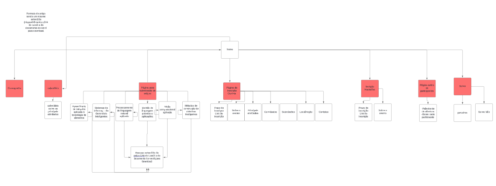

 <h1 align ="center">

</h1>

<h1><a href="https://conima-fatec.github.io/CONIMA/">Veja o Site!</a></h1>
<h1>

</h1>

>CONINMA: Desvendando os Mistérios da Inteligência Artificial e do Aprendizado de Máquina
Em 20 de junho de 2024, a Fatec de Marília convida você para a CONINMA, a Primeira Conferência de Softwares Inteligentes e Aplicações de Aprendizado de Máquina. Um evento único que reúne os futuros craques da tecnologia para uma jornada imersiva neste universo em constante expansão.

>Junte-se a nós e explore as últimas tendências em IA e Machine Learning, conectando-se com empresas da região e impulsionando sua carreira para o futuro da computação.

## Introdução ao Design Thinking

Ao longo do processo de Design Thinking, vivenciamos um ciclo de aprendizado contínuo. Cada etapa nos proporcionou insights valiosos que nos permitiram moldar o CONINMA de acordo com as necessidades reais do público-alvo. Essa metodologia colaborativa e centrada no usuário foi fundamental para o sucesso da conferência, garantindo que ela fosse um evento inovador, relevante e inspirador para todos os participantes.

## Levantamento do problema e requisitos

O projeto foi desenvolvido com o objetivo de atender a necessidade de uma Landing Page para a Conferência de Softwares Inteligentes e Aplicações de Aprendizado de Máquina.
O principal desafio foi resolver a construção de uma página  mais acessível possível.
Os resultados desejados com o final do projeto são uma interface amigável e de fácil acesso para apresentação dos principais objetivos da conferência.
As áreas envolvidas são:design e desenvolvimento. Foram consultados professores na área de Aprendizado de Máquina no processo.
Os responsáveis por conduzir o projeto durante seu desenvolvimento foram a Equipe em conjunto com o professor João.

A abordagem definida para a resolução do problema foi compreender sobre acessibilidade em sites seguindo os parâmetros do W3C.

## Pesquisa com os usuários

>Descrição da Pesquisa com Usuários
Objetivo:

A pesquisa com usuários teve como objetivo coletar informações sobre as características, necessidades e interesses do público-alvo do projeto, a fim de aprimorar o design e a funcionalidade da plataforma de aprendizado de máquina.

>Metodologia: Questionário online com perguntas sobre:

- Dados demográficos
- Localização
- Profissão
- Experiência com tecnologia e aprendizado de máquina
- Hábitos de navegação na internet
- Preferências por layouts e interfaces
- Interesses específicos em aprendizado de máquina

>Resultados:

- Público-alvo: 19-29 anos.
- Interesses: Muito interessado.
- Hábitos: Tempo gasto na internet de Mais de 6 horas por dia,com acesso à internet voltado mais para redes sociais.
- Preferências: Preferência por layout e interface com elementos interativos e designs mais modernos.

>Impacto no Projeto:

- Definição do público-alvo
- Personalização da experiência
- Acessibilidade
- Conteúdo direcionado
- Usabilidade aprimorada
- Engajamento do público

>Persona:

  
  
  

## Arquitetura da informação
>SiteMap:

>Fluxogramas:

## Design da interface

>Mostre o design da interface do projeto, utilizando mockups ou protótipos.

## Documentação

>1.Guia de Estilo

>Paleta de cores:

88085B: O rosa escuro pode evocar emoções de criatividade, inovação e energia.
Impacto: Esta cor pode atrair a atenção e proporcionar um toque de modernidade e ousadia.
Relevância: Ideal para um evento de software e aprendizado de máquina, pois destaca a criatividade e a inovação, atributos essenciais nesse campo.

DD660A O laranja é uma cor quente que representa entusiasmo, fascínio e determinação.
Impacto: É uma cor energizante que pode estimular o público e criar um ambiente dinâmico.
Relevância: Este tom de laranja, mais forte, sugere um ambiente vibrante e acolhedor, incentivando a interação e a participação ativa dos participantes.

EF9A36 O laranja claro traz uma sensação de otimismo, calor e acessibilidade.
Impacto: Pode equilibrar as cores mais escuras e adicionar uma sensação de acolhimento e acessibilidade.
Relevância: Em uma conferência técnica, essa cor pode tornar o ambiente mais amigável e menos intimidante, encorajando a colaboração e a troca de ideias.

FFFFFF: O branco é frequentemente associado à pureza, simplicidade e modernidade.
Impacto: Usar o branco como fundo ou para espaços negativos cria um ambiente limpo e organizado, facilitando a leitura e destacando outras cores da paleta.
Relevância: Em uma conferência sobre tecnologias avançadas, o branco pode representar a clareza e a inovação, deixando os participantes mais focados no conteúdo.

000000: O preto é sinônimo de sofisticação, elegância e poder.
Impacto: Detalhes em preto podem adicionar contraste, tornando os elementos visuais mais impactantes e legíveis.
Relevância: No contexto de conferência, o preto pode simbolizar a seriedade e a importância dos temas discutidos, além de destacar outros elementos coloridos da identidade visual.

>Combinando as Cores:

A combinação das cores escolhidas cria um equilíbrio visual que atrai o público e comunica a mensagem da conferência:
Contraste e Legibilidade: O branco e preto garantem alta legibilidade e um contraste que facilita a leitura e compreensão dos materiais.
Energia e Inovação: Os tons de rosa escuro e laranja avermelhado transmitem energia, inovação e um toque moderno.
Acolhimento e Acessibilidade: O laranja claro suaviza a paleta, tornando-a mais acolhedora e acessível.

>1.2 Tipografia

>Fonte:

Nome: Arial
Estilo: Sans-serif
Licença: Comercial
Disponibilidade: Amplamente disponível em sistemas operacionais e softwares
Características: Legível, versátil, familiar, clean, clássica
Família:

- Nome: Inter
- Estilo: Sans-serif
- Licença: Open Source (SIL Open Font License 1.1)
- Disponibilidade: Gratuita para download e uso
- Características: Moderna, amigável, otimizada para leitura em telas, diversas opções de pesos e estilos, espaçamento otimizado
Observações:

A combinação de Arial e Inter pode ser interessante para projetos que exigem clareza e modernidade. A Arial é uma fonte clássica e familiar, enquanto a Inter oferece um visual mais atual e otimizado para telas.

## Considerações finais

Compartilhe o que foi aprendido durante o processo e o desenvolvimento pessoal da equipe.

##  Instalando <nome_do_projeto>

... (Instruções de instalação)

##  Colaboradores

... (Lista de colaboradores com fotos e links)

##  Licença

... (Indicação da licença do projeto)
